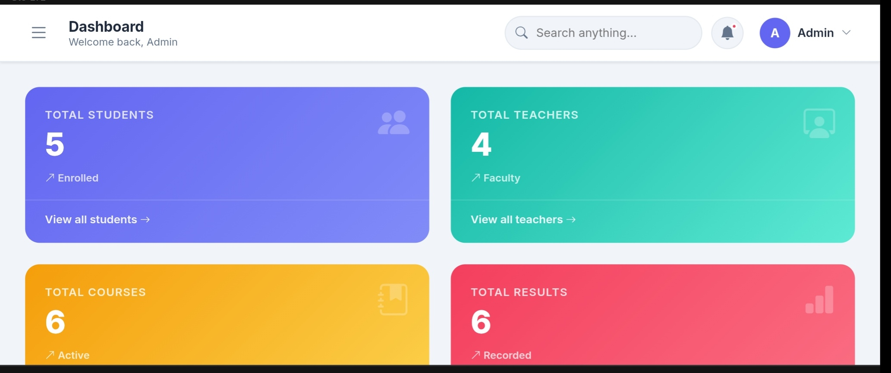
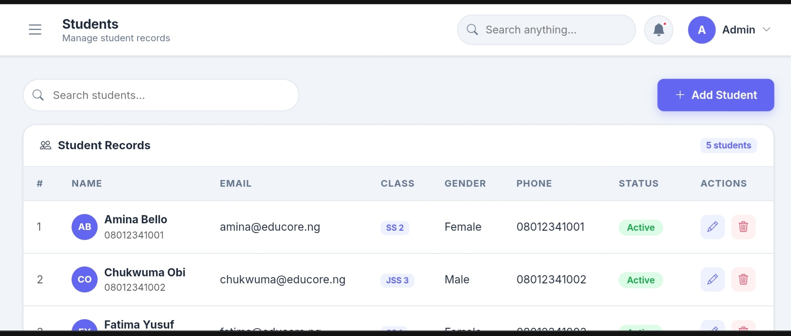
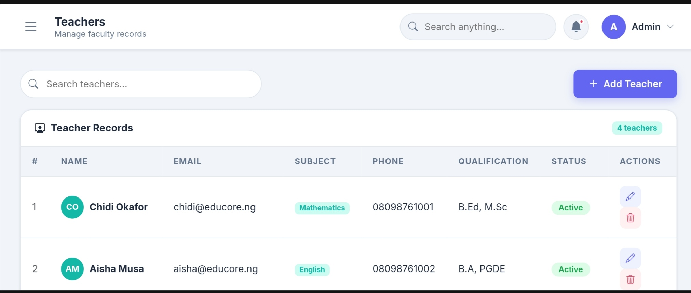
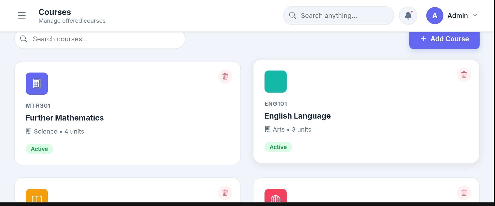
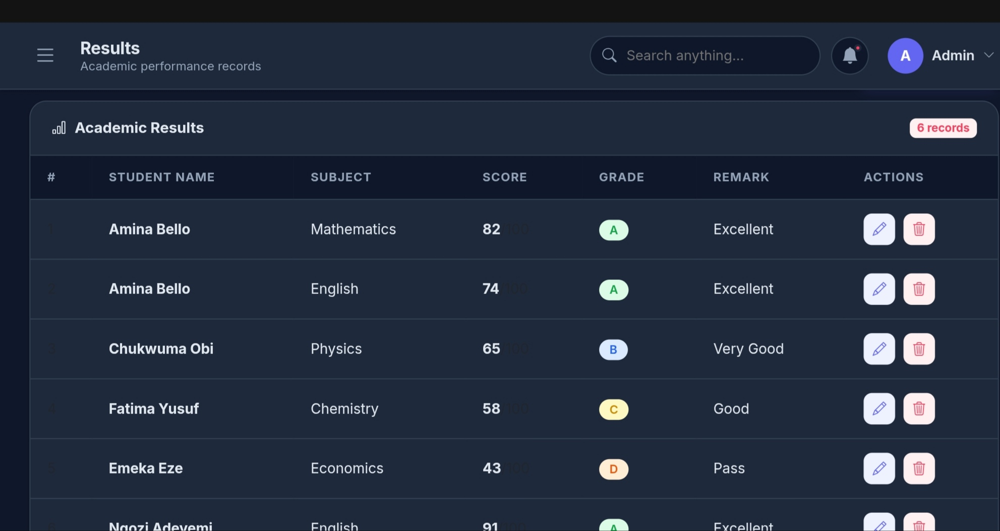
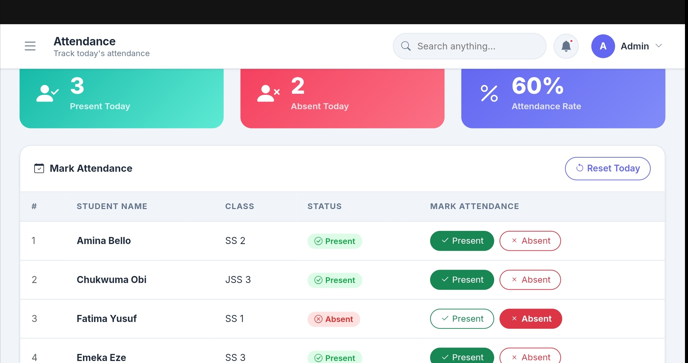
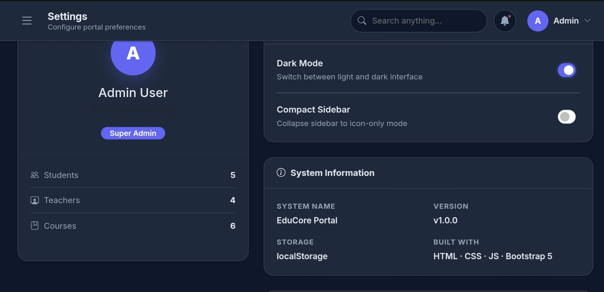
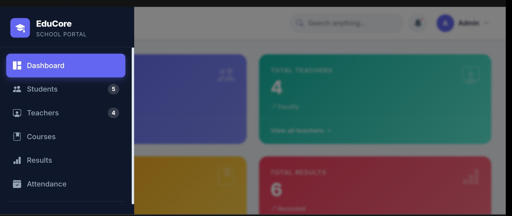
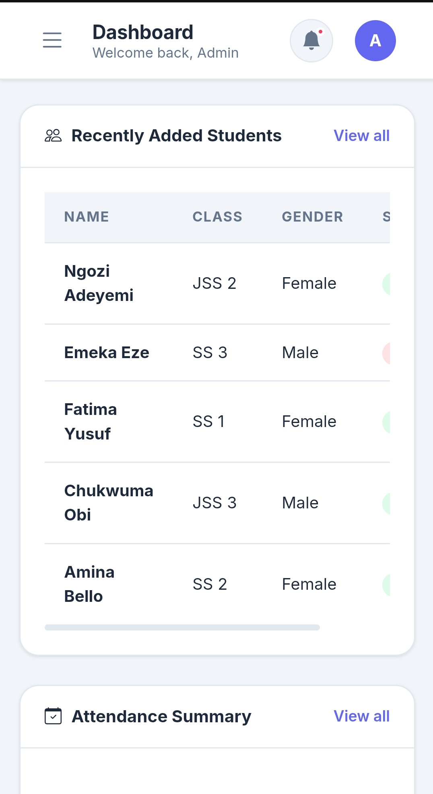

# EduCore School Management Portal

EduCore is a responsive school management system built with HTML, CSS, and Vanilla JavaScript. It simulates real-world school operations including student management, teacher records, courses, results, and attendance tracking using localStorage.

## 🚀 Features
- Student CRUD system
- Teacher management
- Course management
- Result grading system
- Attendance tracker
- Dashboard analytics
- Dark mode support
- Mobile responsive UI
- LocalStorage persistence

## 🛠 Tech Stack
- HTML5
- CSS3
- JavaScript (ES6+)
- Bootstrap 

## 📦 How to Run
Just open `index.html` in your browser.

## Screenshots

### Dashboard

### Students Management

### Teachers Management

### Courses Management

### Results Management

### Attendance Tracker

### Settings

### Dark Mode

### Mobile Responsive View

##  Repository link
https://github.com/japhet996sunday-cell/educore-school-portal

## 🌐 Live Demo
[https://japhet996sunday-cell.github.io/educore-school-portal/]

## 👨‍💻 Author
Japhet Sunday
